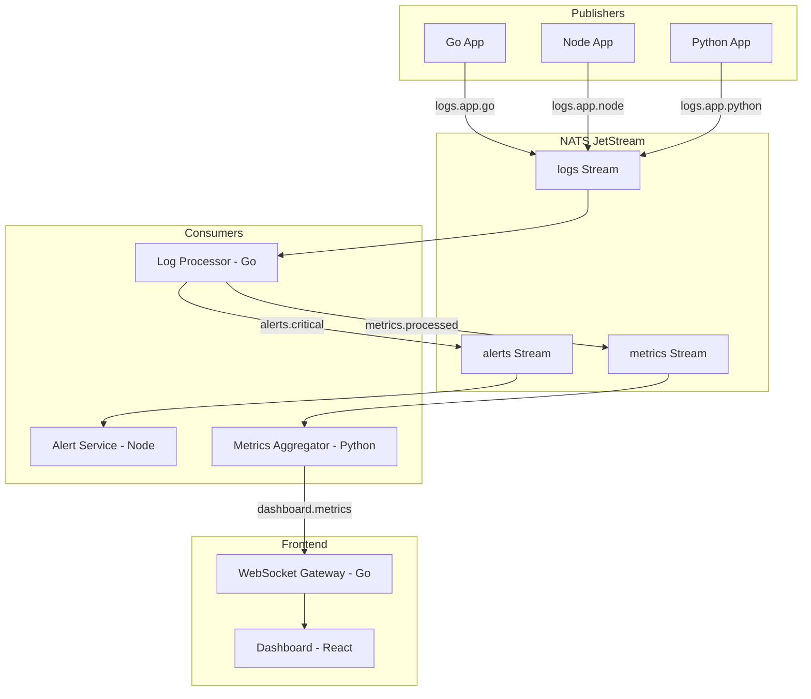

# NATS TLS ログ収集・分析パイプライン

NATSとJetStreamを活用したリアルタイムログ収集・分析パイプラインのデモプロジェクト。

## アーキテクチャ



## サービス構成

| サービス | 言語 | 役割 |
| -------- | ---- | ---- |
| log-publisher | Go | 構造化ログを生成・送信 |
| log-processor | Go | ログ解析・ルーティング |
| alert-service | Node.js | アラート通知 |
| metrics-aggregator | Python | メトリクス集計 |
| ws-gateway | Go | NATS→WebSocketブリッジ |
| dashboard | React + Vite | リアルタイムダッシュボード |

## Subject設計

| Subject | 用途 |
| ------- | ---- |
| `logs.app.{service}` | 各サービスからのログ |
| `logs.level.{level}` | ログレベル別のルーティング |
| `alerts.{severity}` | アラート通知 |
| `metrics.{type}` | メトリクスデータ |
| `dashboard.updates` | ダッシュボード更新 |

## JetStream設計

| Stream | Subjects | 保持期間 | 用途 |
| ------ | -------- | -------- | ---- |
| LOGS | `logs.>` | 24時間 | ログの永続化 |
| ALERTS | `alerts.>` | 7日間 | アラート履歴 |
| METRICS | `metrics.>` | 1時間 | メトリクス集計 |

## ディレクトリ構成

```shell
.
├── compose.yml              # 全サービス定義
├── config/
│   └── nats-server.conf     # NATS設定
├── scripts/
│   ├── generate-certs.sh    # TLS証明書生成
│   ├── entrypoint.sh        # NATS起動スクリプト
│   └── init-streams.sh      # JetStream初期化
├── services/
│   ├── log-publisher/       # ログ生成サービス（Go）
│   ├── log-processor/       # ログ解析・ルーティング（Go）
│   ├── alert-service/       # アラート通知（Node.js）
│   ├── metrics-aggregator/  # メトリクス集計（Python）
│   ├── ws-gateway/          # WebSocket Gateway（Go）
│   └── dashboard/           # Reactダッシュボード
└── shared/
    └── schemas/             # メッセージスキーマ定義
```

## クイックスタート

```bash
# 起動
docker compose up --build

# ダッシュボードにアクセス
open http://localhost:3000

# NATSモニタリング
open http://localhost:8222
```

## メッセージスキーマ

### LogEntry

```json
{
  "timestamp": "2024-01-10T12:00:00Z",
  "service": "user-api",
  "level": "ERROR",
  "message": "Database connection failed",
  "metadata": {
    "request_id": "abc-123",
    "user_id": "user-456"
  }
}
```

### Alert

```json
{
  "timestamp": "2024-01-10T12:00:00Z",
  "severity": "critical",
  "source": "log-processor",
  "title": "High Error Rate Detected",
  "message": "Error rate exceeded 10% in last 5 minutes",
  "context": {
    "service": "user-api",
    "error_count": 150,
    "total_count": 1000
  }
}
```

### Metrics

```json
{
  "timestamp": "2024-01-10T12:00:00Z",
  "window_seconds": 5,
  "total_logs": 1000,
  "by_level": {
    "DEBUG": 500,
    "INFO": 300,
    "WARN": 150,
    "ERROR": 45,
    "CRITICAL": 5
  },
  "by_service": {
    "user-api": 400,
    "order-api": 350,
    "payment-api": 250
  },
  "error_rate": 0.05
}
```

## 開発

```bash
# 個別サービスのビルド
docker compose build log-processor

# ログ確認
docker compose logs -f log-processor

# JetStreamストリーム確認
docker exec -it nats-tls-server nats stream ls
```

## TLS設定

本プロジェクトは相互TLS認証を使用。証明書は初回起動時に自動生成される。

- CA証明書: `/etc/nats/certs/ca.pem`
- サーバー証明書: `/etc/nats/certs/nats-server-cert.pem`
- クライアント証明書: `/etc/nats/certs/nats-client-cert.pem`
